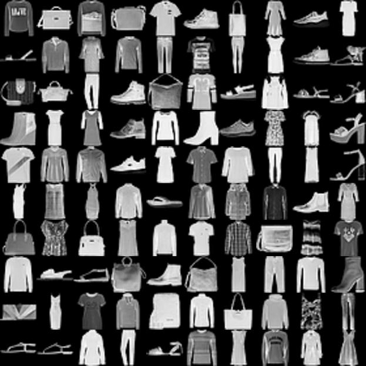

# CNN-AutoEncoder-on-the-Mnist-Dataset

## Description
In this project, I will implement a CNN autoencoder for the Fashion-MNIST dataset, and examine the learned encodings.

*Fashion MNist Dataset Sample*

## AutoEncoder Summary

AutoEncoders are a combination of two Neural Networks namely the Encoder (which aims to decompress the data to a reduced dimensional space) and the Decoder (which aims to reconstruct the orignial data from this reduced dimenional encoded space). In case of simple autoencoders, the output is expected to be the same as the input with reduced noise. Simple autoencoders are **deterministic**, in that they decompress the input to a reduced space and then try to reconstruct the input from this encoded space. Variational AutoEncoders, on the other hand, are Probablitic models since they learn to encode a latent distribution (learn mean and std vectors for each of the latent variables), we then sample from this latent distribution and then aim to decode this sample. The output is the decoded manifestation of the sampled latent representation.

## Implementation
I trained a CNN encoder to take (28,28,1) grey-scale images and encode as much infomation as possible into a (2,) dimensional encoded space. I used TensorFlow.Keras.models.Model model to combine the two neural networks. A Binary cross Entropy is used as the loss function, to calculate the loss between the original (normalised to (0,1)) input image and the reconstructed image. I used the defult 'RMSprop' Optimizer to optimize the weights. 

## Results
Here are the results:
FF

So we can see that the clusters are far more condensed after the trained encoding meaning that our encoder is in fact encoding. Intrestingly we see that clothing that is similar in apperance and usage are more closely clustered - with overlaps. For example 'ankle boot' (brown), 'sneaker' (orange) and 'sandal' (light green) which we wear on our feet are seperate from the other clusters which represent clothes we wear on our body! This makes sense since footwear have features that are seperate and distingwishable from clothing and hence are represented seperately in the encoding space! We can also see that clothing that is similar and hence share similar features overlap in the encoding space. Shirt (yellow), for example has a large spread and overlaps several classes, but doesnt overlap (as heavely) trousers (light purple).
Given that we have taken a (28,28,1) image and compressed it down to a (2,) dimenional space, we see that relatively large amounts of infomation remain and that there is infact some interprebility from the clusterings!

Here are some reconstructions and the orginal images taken from the test set! 

 
